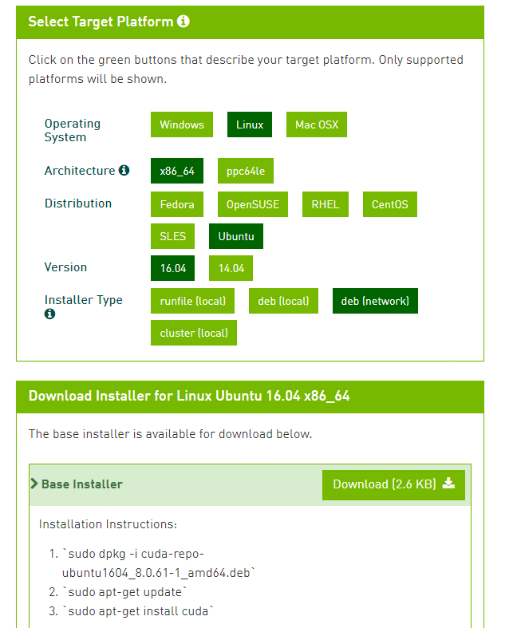

> 最近在安装 CUDA/CUDNN/CAFFE，简直是呕心沥血、可歌可泣，说多了都是泪。其主要原因是，这几个库和本机的多种软硬件环境的差异造成的。我觉得在这个过程中，我收获最多的就是我的耐心得到了极大的锻炼[doge]。


# 安装过程中遇到的问题
## ImportError: libcublas.so.8.0: cannot open shared object file: No such file or directory
我选择在线安装 [`cuda 8.0`](https://developer.nvidia.com/cuda-80-ga2-download-archive) 。但是，这样安装下来，竟然安装的是 `libcublas 9.0`。后面只能用 `deb(local)` 的模式安装。
目前还不明白为什么。




## protoc: Command not found
这个需要安装一下 [`protobuf`](https://github.com/google/protobuf)
```Shell
sudo apt-get install protobuf-c-compiler protobuf-compiler
```
## 


# 注意事项
- 安装 `tensorflw` 时，需要一些库可能会与 `caffe` 的库起冲突，所以要先安装 `caffe` 再安装 `tensorflow`。
- `OpenCV` 在安装的过程中，会检查本机中相关的 `cuda` 等库，所以要先安装 `cuda` 再安装 `OpenCV`。