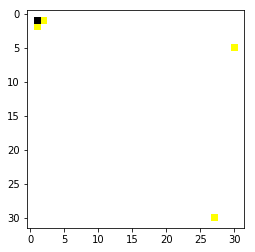

```python
import sys
import numpy as np
sys.path.insert(0, './assignment1/')
print(sys.path)
```

    ['./assignment1/', '', '/Users/cslzy/.pyenv/versions/3.6.1/lib/python36.zip', '/Users/cslzy/.pyenv/versions/3.6.1/lib/python3.6', '/Users/cslzy/.pyenv/versions/3.6.1/lib/python3.6/lib-dynload', '/Users/cslzy/.local/lib/python3.6/site-packages', '/Users/cslzy/.pyenv/versions/3.6.1/lib/python3.6/site-packages', '/Users/cslzy/.local/lib/python3.6/site-packages/IPython/extensions', '/Users/cslzy/.ipython']


```python
from cs231n.data_utils import load_CIFAR10
```


```python
Xtr, Ytr, Xte, Yte = load_CIFAR10('/Users/cslzy/lizhenyang.github.io/posts/cs231n/assignment1/cs231n/datasets/cifar-10-batches-py')
```


```python
Xtr.shape
```


    (50000, 32, 32, 3)


```python
from matplotlib.pyplot import imshow
```


```python
imshow(Xtr[0])
```

    Clipping input data to the valid range for imshow with RGB data ([0..1] for floats or [0..255] for integers).


    <matplotlib.image.AxesImage at 0x113198e48>





```python
Xtr_rows = Xtr.reshape(Xtr.shape[0], 32 * 32 * 3)
```


```python
Xte_rows = Xte.reshape(Xte.shape[0], 32 * 32 * 3)
```


```python
Xtr_rows.shape
```


    (50000, 3072)


```python
from cs231n.classifiers import KNearestNeighbor as NearestNeighbor
```


```python
nn = NearestNeighbor()
```


```python
nn.train(Xtr_rows, Ytr)
```


```python
Yte_predict = nn.predict(Xte_rows)
```


```python
print('Accuracy: %f' % np.mean(Yte_predict == Yte))
```

    Accuracy: 0.100000


```python
Ypre = []
for i in range(Xte_rows.shape[0]):
    distance = np.sum(np.abs(Xtr_rows - Xte_rows[i, :]), axis = 1)
    idx = np.argmin(distance)
    Ypre.append(Ytr[idx])
    print(idx)

```

    47188
    7535
    37153
    37867
    1881
    16603
    38805
    910
    12826
    12544
    45115
    139
    8398
    24771
    28049
    21064
    43762
    80
    3059
    33357
    36677
    41164
    4282
    42251
    14073
    34352
    19217
    24063


```python
print('Accuracy: %f' % np.mean(Ypre == Yte))
```


```python
for i in range(10):
    print i, 10
```
