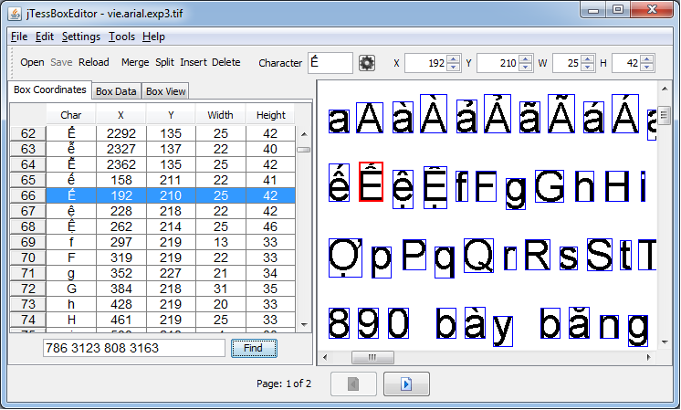
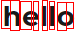

# Connectionist Temporal Classification
> 因为最近做了一些用连续标签做文字识别标签任务的工作，对 ctc 有了一些了解，在此记录一下。

在学习 CTC 的时候，也看了不少博客，但是我觉得讲的最好的还是原论文 [Connectionist Temporal Classification: Labelling Unsegmented Sequence Data with Recurrent Neural Networks](http://citeseerx.ist.psu.edu/viewdoc/download?doi=10.1.1.75.6306&rep=rep1&type=pdf) 解释的最清楚。
对于没接触过这个概念的人，可能加一些例子会更好理解一些。
我就来加一些例子。

# 背景知识
用实例来说，我们在做 ocr 工作时，我们希望给一行文字的图片让机器识别出来这个图片里面的文字。
语音识别任务中，给了一段语音片段，我们希望能把这段语音识别成可编辑的文字。
但是，在对每个片段进行分类模型训练之前，需要对每个训练样本进行切割标注。
这是项非常繁琐的工作非常不利于模型的训练。

下面是个对文字进行标注的工具，大家可以看一下。如果我们在做文字识别工作时，对每个文字都要明确标出这个字在图片中的位置、高、宽，这将会是一个多么巨大的工作量。

RNNs 在序列学习任务中有着优越的性能，但是它也有一些缺点。
如，在上面描述的那种对输入模型的数据需要预处理的缺点。同时，对 RNNs 的序列也需要一定的整合才能得到最终的预测序列。
而 CTC 解决了对输入序列的单个词的切分和对输入序列的整合工作。

输入序列的切分与标注上面已经举了一个例子，现在举一个输出序列整合的例子。
我们现在有一个图片的输入 。
假设这个图片中每个红都作为 RNN 的一步输入，那么（如果这个模型训练的还不错的话）它的输出序列应该是 `hheelloo`。
但是，我们知道 RNN 每一步的输出其实都是一组概率分布，$$p(l|x), l \in Alphebat$$。
