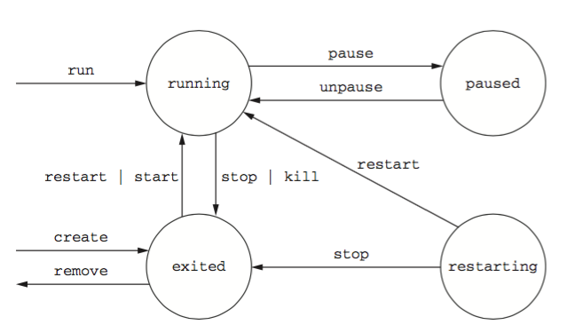
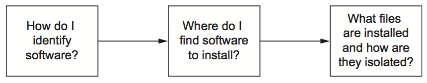
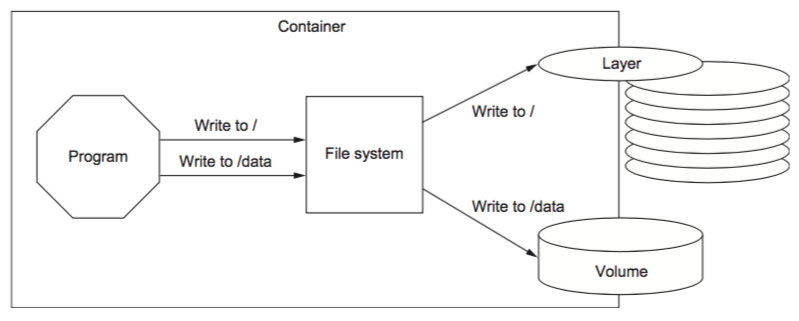

# docker in action
# Reference
## docker PID namespace
docker 的进程 ID 命名空间解决了如下问题：
1. 不同程序依赖同一库的不同版本的问题（每个 container 里面有一个所需的库的版本）
2. 不同进程依赖同一端口的问题（加上 container 的名字）
3. 一个进程改变了一个资源的名称，而另外一个进程依赖于这个名称（如临时文件名）

## Build environment-agnostic system
docker 通过如下三种方法构建一个环境无关的系统：
1. read-only file(加 --read-only)
2. 在运行 docker container 时候注入环境变量（并没有体会到这个和在 container 里面添加变量的差异，这样做倒是可以批量起动 docker container.）
3. volumes

## docker commands
### docker commit -m "message" container new_image_name:version
把正在运行的 container 保存成 image。比较好用。

### docker start -i container
用命令行的方式运行一个停止的 container 。

## Docker Automatically Restarting
1. 默认不自动重启
2. 检测到失败（失败？退出状态吗？）重启
3. 在某些预定的时刻，如果检测到失败，就重启
4. 不管任何状态（正常运行状态？），都重启

### 问题
1. 一个正在运行的 container 怎么挂载 volume 呢？和正常运行时候挂载 volume 是一样的吗？
# Column Two
Detached means that the container will run in the background, without being attached to any input or output stream.

## -d
Running detached containers is a perfect fit for programs that sit quietly in the background. That type of program is called a daemon.
> docker run -d --name mailer dockerinaction/ch2_mailer

后台运行

## Running interactive containers
> docker run --interactive --tty \     -- Create a virtual terminal and bind stdin
else> --link web:web \
else> --name web_test \
else> busybox:latest /bin/sh

-i: 为 container 开放一个 terminal。（不是很明白）
-t: 为 container 分配一个虚拟 terminal。
### 上面两个什么差别？
一个是内部的，一个是外部的？
```
It’s possible to create an interactive container, manually start a process inside that container, and then detach your terminal. You can do so by holding down the Crtl (or Control) key and pressing P and then Q. This will work only when you’ve used the --tty option.
```
### 退出一个交互式 container，并保持其在后台运行的方法
hold the Ctrl (or Control) key and then press P and then Q.
## agent
docker run -it \                                   [06:34:53]
else>     --name agent \
else>     --link web:insideweb \
else>     --link mailer:insidemailer \
else>     dockerinaction/ch2_agent

## logs is useful but dangerous
The docker logs command can be helpful for these cases but is dangerous to rely on. Anything that the program writes to the stdout or stderr output streams will be recorded in this log.
随着程序的持续，这种 log 会一直输出。对存储来说，是一个问题。

docker logs container -f

## docker stop PID #1 in a container
The docker stop command tells the program with PID #1 in the container to halt.

# 2.3 Solved problems and the PID namespace
A PID namespace is the set of possible numbers that identify processes.
Creating a PID namespace for each container is a critical feature of Docker.
## namespace 可能会造成权限紊乱。
Without a PID namespace, the processes running inside a container would share the same ID space as those in other containers or on the host. A container would be able to determine what other processes were running on the host machine. Worse, namespaces transform many authorization decisions into domain decisions.

## 同机的多个进程请求同一资源时，会起冲突。docker 很好地隔离了这一问题。
Suppose you were not using Docker and were just running NGINX directly on your computer. Now suppose you forgot that you had already started NGINX for another project. When you start NGINX again, the second process won’t be able to access the resources it needs because the first process already has them.

## 典型的冲突
conflict arises when you want to use two pro- grams that require different versions of a library.

## 依赖库版本的修改
Lastly, consider what would happen if someone changed the space numbers in the parking lot while cars were parked. When owners return and try to locate their vehicles, they may be unable to do so.

## 冲突条件
All these conflicts arise when one or more programs have a common dependency but can’t agree to share or have different needs.
## docker 起到的隔离作用，PID namespace，文件权限系统，网络端口
Like in the earlier port conflict example, Docker solves software conflicts with such tools as Linux namespaces, file system roots, and virtualized network components.
# 2.4 Eliminating metaconflicts: building a website farm

## docker 默认命名规范
By default Docker assigns a unique (human-friendly) name to each con- tainer it creates. The --name flag simply overrides that process with a known value.
### rename a docker container
docker rename old-container new-container

## 使用 interactive 交互模式时，无法得到 docker id，而使用 docker create 创建一个不活动的 docker container 就可以。（使用 --cidfile 可以创建保存 cid 的文件）
As you saw earlier, when a new container is started in detached mode, the container ID will be written to the terminal (stdout).
You’d be unable to use this with interactive containers if this were the only way to get the container ID at creation time.
Luckily you can use another command to create a container without starting it.

docker create 可以创建一个静止的 docker container 同时给出 docker id，弥补了 docker run -it 的不足。

## 在 shell session 中使用 hash code 仍然会造成冲突，但是这种冲突被限制在了一次 shell session 中。
Shell variables create a new opportunity for conflict, but the scope of that conflict is limited to the terminal session or current processing environment that the script was launched in. Those conflicts should be easily avoidable because one use or program is managing that environment.

## 创建 cid 文件
cslzy@cslzy-Air  ~ 
❯ docker create --cidfile /tmp/web.cid nginx         [10:24:34]
e2247122268eb713c3cf5aec4bacef3efdb2a6cc7190936a636f857758a77fba

cslzy@cslzy-Air  ~ 
❯ cat /tmp/web.cid                                   [10:24:42]
e2247122268eb713c3cf5aec4bacef3efdb2a6cc7190936a636f857758a77fba

## cid file 的优势
One reason to use CID files instead of names is that CID files can be shared with containers easily and renamed for that container.
## 形容词、下划线、名人名
The naming convention uses a personal adjective, an underscore, and the last name of an influential scientist, engineer, inventor, or other such thought leader.

## 总结 docker name
Container identification can be tricky, but you can manage the issue by using the ID and name-generation features of Docker.
# 2.4.2 Container state and dependencies

## 创建 container 并用环境变量保存 container id
MAILER_CID=$(docker run -d dockerinaction/ch2_mailer)
WEB_CID=$(docker create nginx)
AGENT_CID=$(docker create --link $WEB_CID:insideweb \
cmdsubst else>     --link $MAILER_CID:insidemailer \
cmdsubst else>     dockerinaction/ch2_agent)

## docker container 的状态

docker ps 只显示 running 状态的 container。

## 怎么理解 IP injects 机制？
The link mechanism injects IP addresses into dependent containers, and containers that aren’t running don’t have IP addresses.

## 在 docker 中环形依赖是不可能的，它的依赖只能是拓扑图。
This means that circular dependencies are impossible to build using Docker container relationships.

## 虽然，把几个容器的启动命令写到一起，可以顺序执行。但我不确定，下一条启动命令执行时，上一个容器是否正常启动了。

## 内容或者状态管理系统，因其内容或状态而不同。而这个系统可以是完全相同的。
The interesting thing about content-management systems and other stateful sys- tems is that the data they work with makes each running program specialized.

# 2.5 Building environment-agnostic systems
如果系统不需要知道环境是什么样子的，那么这个系统移植起来就比较方便。

## Docker has three specific features to help build environment-agnostic systems:
■ Read-only file systems
■ Environment variable injection
■ Volumes

## 只读系统的优势
- 不会因为系统的文件改变而使容器有什么不同。
- 不会因为被攻击而被写入什么文件。

## 创建只读 container
docker run -d --name wp --read-only wordpress:4

## 从容器 info 里面看信息
docker inspect --format "{{\.State\.Running}}" mailer

## --read-only 文件系统里面使用 -v 来指定可以写的地方。
# Start the container with specific volumes for read only exceptions
SQL_CID=$(docker create -e MYSQL_ROOT_PASSWORD=ch2demo mysql:5)
docker start $SQL_CID
MAILER_CID=$(docker create dockerinaction/ch2_mailer)
docker start $MAILER_CID
WP_CID=$(docker create --link $SQL_CID:mysql -p 80 \
    -v /run/lock/apache2/ -v /run/apache2/ \
    --read-only wordpress:4)
docker start $WP_CID
AGENT_CID=$(docker create --link $WP_CID:insideweb \
    --link $MAILER_CID:insidemailer \
    dockerinaction/ch2_agent)
docker start $AGENT_CID

## Environment variable injection
-e 不算是环境变量的注入吗？
密码怎么办？

## env 可以用来查看当前的环境变量

# 2.6 Build durable containers

## 无间断重启反而会造成更多问题，所以 docker 会等一会。
Docker doesn’t always attempt to immediately restart a container. If it did, that would cause more problems than it solved.
这里举了个例子：
Imagine a container that does nothing but print the time and exit. If that container was configured to always restart and Docker always immediately restarted it, the system would do nothing but restart that container.

docker run -d --name backoff-detector --restart always busybox date

## dockr 重启策略
Docker uses an exponential backoff strategy for timing restart attempts.

## entrypoint?
This failed because even though you set the command to run as cat /entrypoint.sh, Docker containers run something called an entrypoint before executing the command.

docker run --entrypoint="cat" \
    wordpress:4 /entrypoint.sh

docker container 在执行前的检测？
所以才可以使用 --entrypoint='cat'?

Try running the last command again but this time using the --entrypoint flag to specify the program to run and using the command section to pass arguments:
 docker run --entrypoint="cat" \
    wordpress:4 /entrypoint.sh

## 要点有两个：一、重启；二、预检测。

# 2.7 Cleaning up
Ease of cleanup is one of the strongest reasons to use containers and Docker.
With Docker, the whole cleanup process is reduced to one of a few simple commands.

## docker stop & docker rm -f: hang up & kill
The key difference is that when you stop a process using the -f flag, Docker sends a SIG_KILL signal, which immediately terminates the receiving pro- cess. In contrast, using docker stop will send a SIG_HUP signal.


## docker stop 最长用时 30 s?
You can issue a SIG_KILL directly to a container using the docker kill command. But you should use docker kill or docker rm -f only if you must stop the container in less than the standard 30-second maximum stop time.

## container 退出时删除
--rm

# 2.8 Summary
The primary focus of the Docker project is to enable users to run software in contain- ers.
容器不是 docker 专有的概念。


# 3
# Software installation simplified
本章的主线，如图 ，包括 如何唯一确定一个软件、如何找到这个软件、安装了什么软件以及如何做到隔离的。

# 3.1 Identifying software
其实这部分讲的是如何唯一确定 docker image:tag

## image identifier 不友好
Image identifiers are difficult to work with because they’re unpredictable. Instead, users work with repositories.
## name:tag is predictable and comunicate the intention of the image.
A repository name and tag form a composite key, or a unique reference made up of a combination of non-unique components. In that example, the image was identified by nginx:latest. Although identifiers built in this fashion may occasionally be longer than raw image identifiers, they’re predictable and communicate the intention of the image.

## 搜索 docker images
docker search postgres

## star 可以作为 image 质量的标准，但是不能作为代码是否可信的标准。比如，有天帐户被劫持了。。
Docker Hub lets users star a repository, similar to a Facebook Like. This is a reasonable proxy indicator for image quality, but you should be careful not to use it as an indicator of trustworthy code.

## 使用公开脚本创建的 image 列
In the search results from running docker search, you can tell that an image was built from a public script by looking for an [OK] in the column label AUTOMATED.

## 第三方 registry
Docker knows how to talk to Docker registries, so the only difference is that you spec- ify the registry host.

## docker save 创建一个 tar 文档
I used the .tar filename suffix in this example because the docker save command creates TAR archive files. You can use any filename you want. If you omit the –o flag, the resulting file will be streamed to the terminal.

## save and load
docker pull busybox:latest
docker save -o myfile.tar busybox:latest

docker load –i myfile.tar

# 3.2.5 Installing from a Dockerfile

# 3.3 Installation files and isolation
Understanding how images are identified, discovered, and installed is a minimum proficiency for a Docker user.
## layer
A layer is an image that’s related to at least one other image.
## ?union file system

## Benefits of this toolset and file system structure
文件复用方面优于虚拟机技术。
The first and perhaps most important benefit of this approach is that common layers need to be installed only once.
By contrast, most virtual machine technologies will store the same files as many times as you have redundant virtual machines on a computer.

Second, layers provide a coarse tool for managing dependencies and separating concerns.
这个还不是很理解，用户怎么通过 layer 来知道不同层的依赖关系的？

Lastly, it’s easy to create software specializations when you can layer minor changes on top of some basic image. Providing specialized images helps users get exactly what they need from software with minimal customization. This is one of the best reasons to use Docker.

## Weaknesses of union file systems
不是很理解下面这些。。是因为我不了解文件系统。
下面这些是不是讲不同文件系统之间的规则差异较大？
Different file systems have different rules about file attributes, sizes, names, and characters. Union file systems are in a position where they often need to translate between the rules of different file systems.


## ufs
Union file systems use a pattern called copy-on-write, and that makes implement- ing memory-mapped files (the mmap() system call) difficult.

## 文件系统是可以变更的
The backing file system is another pluggable feature of Docker. You can determine which file system your installation is using with the info subcommand.

If you want to specifically tell Docker which file system to use, do so with the --storage-driver or -s option when you start the Docker daemon.

## ？ layer 指的单独一层，还是指当前层到下面所有的？

# 4
# Persistent storage and shared state with volumes
The difference between the examples in the first three chapters and the real world is that in the real world, programs work with data.
■ An introduction to volumes
■ The two types of volumes
■ How to share data between the host and a container
■ How to share data between containers
两个 container 怎么交互数据呢？
■ The volume life cycle
■ Data management and control patterns with volumes

## 图示 container 中的 volume 和 layer

# ? volume 是什么？
A volume is a mount point on the container’s directory tree where a portion of the host directory tree has been mounted.
这个和我理解的一样，就是把主机的一个文件目录树挂载到 container 里面。

# 4.1.1 Volumes provide container-indenpendent data management

Semantically, a volume is a tool for segmenting and sharing data that has a scope or life cycle that’s independent of a single container.
## polymorphic
镜像如同程序，而数据如同参数，volume 可以看作一个存放参数的地方。
This separation of rela- tively static and dynamic file space allows application or image authors to implement advanced patterns such as polymorphic and composable tools.

## volume 可以在不改变镜像的基础上，改变容器的行为。
Using volumes, you can inject behavior into containers without modifying an image.
