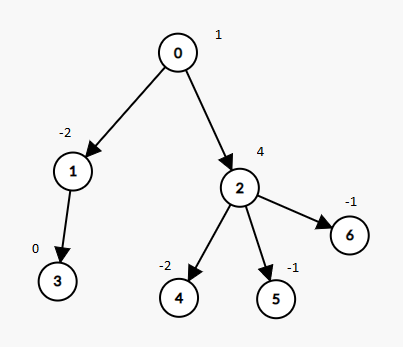

# week 49
## 5282. Minimum Number of Flips to Convert Binary Matrix to Zero Matrix
User Accepted:0
User Tried:0
Total Accepted:0
Total Submissions:0
Difficulty:Hard
Given a m x n binary matrix mat. In one step, you can choose one cell and flip it and all the four neighbours of it if they exist (Flip is changing 1 to 0 and 0 to 1). A pair of cells are called neighboors if they share one edge.

Return the minimum number of steps required to convert mat to a zero matrix or -1 if you cannot.

Binary matrix is a matrix with all cells equal to 0 or 1 only.

Zero matrix is a matrix with all cells equal to 0.

 

Example 1:


Input: mat = [[0,0],[0,1]]
Output: 3
Explanation: One possible solution is to flip (1, 0) then (0, 1) and finally (1, 1) as shown.

Example 2:

Input: mat = [[0]]
Output: 0
Explanation: Given matrix is a zero matrix. We don't need to change it.
Example 3:

Input: mat = [[1,1,1],[1,0,1],[0,0,0]]
Output: 6
Example 4:

Input: mat = [[1,0,0],[1,0,0]]
Output: -1
Explanation: Given matrix can't be a zero matrix
 

Constraints:

m == mat.length
n == mat[0].length
1 <= m <= 3
1 <= n <= 3
mat[i][j] is 0 or 1.

### 理解
反转成 0 矩阵

## 5281. Find the Smallest Divisor Given a Threshold
Given an array of integers nums and an integer threshold, we will choose a positive integer divisor and divide all the array by it and sum the result of the division. Find the smallest divisor such that the result mentioned above is less than or equal to threshold.

Each result of division is rounded to the nearest integer greater than or equal to that element. (For example: 7/3 = 3 and 10/2 = 5).

It is guaranteed that there will be an answer.

 

Example 1:

Input: nums = [1,2,5,9], threshold = 6
Output: 5
Explanation: We can get a sum to 17 (1+2+5+9) if the divisor is 1. 
If the divisor is 4 we can get a sum to 7 (1+1+2+3) and if the divisor is 5 the sum will be 5 (1+1+1+2). 
Example 2:

Input: nums = [2,3,5,7,11], threshold = 11
Output: 3
Example 3:

Input: nums = [19], threshold = 5
Output: 4
 

Constraints:

1 <= nums.length <= 5 * 10^4
1 <= nums[i] <= 10^6
nums.length <= threshold <= 10^6

### 理解

找一个数值，使每个数字除以它的累积和小于等于阈值。
这个数字月小约好。
就是累积和越接近阈值约好。


# week 47
## 1278. Palindrome Partitioning III
You are given a string s containing lowercase letters and an integer k. You need to :

First, change some characters of s to other lowercase English letters.
Then divide s into k non-empty disjoint substrings such that each substring is palindrome.
Return the minimal number of characters that you need to change to divide the string.

 

Example 1:

Input: s = "abc", k = 2
Output: 1 

Explanation: You can split the string into "ab" and "c", and change 1 character in "ab" to make it palindrome.

Example 2:

Input: s = "aabbc", k = 3
Output: 0

Explanation: You can split the string into "aa", "bb" and "c", all of them are palindrome.

Example 3:

Input: s = "leetcode", k = 8
Output: 0
 

Constraints:

1 <= k <= s.length <= 100.
s only contains lowercase English letters.

## 5277. Count Square Submatrices with All Ones
Example 1:

Input: matrix =
[
  [0,1,1,1],
  [1,1,1,1],
  [0,1,1,1]
]
Output: 15
Explanation: 
There are 10 squares of side 1.
There are 4 squares of side 2.
There is  1 square of side 3.
Total number of squares = 10 + 4 + 1 = 15.
Example 2:

Input: matrix = 
[
  [1,0,1],
  [1,1,0],
  [1,1,0]
]
Output: 7
Explanation: 
There are 6 squares of side 1.  
There is 1 square of side 2. 
Total number of squares = 6 + 1 = 7.
 

Constraints:

1 <= arr.length <= 300
1 <= arr[0].length <= 300
0 <= arr[i][j] <= 1

### 理解
这个就是算不为零的子矩阵。

## 1274. Number of Ships in a Rectangle
(This problem is an interactive problem.)

On the sea represented by a cartesian plane, each ship is located at an integer point, and each integer point may contain at most 1 ship.

You have a function Sea.hasShips(topRight, bottomLeft) which takes two points as arguments and returns true if and only if there is at least one ship in the rectangle represented by the two points, including on the boundary.

Given two points, which are the top right and bottom left corners of a rectangle, return the number of ships present in that rectangle.  It is guaranteed that there are at most 10 ships in that rectangle.

Submissions making more than 400 calls to hasShips will be judged Wrong Answer.  Also, any solutions that attempt to circumvent the judge will result in disqualification.

 

Example :


Input: 
ships = [[1,1],[2,2],[3,3],[5,5]], topRight = [4,4], bottomLeft = [0,0]
Output: 3
Explanation: From [0,0] to [4,4] we can count 3 ships within the range.
 

Constraints:

On the input ships is only given to initialize the map internally. You must solve this problem "blindfolded". In other words, you must find the answer using the given hasShips API, without knowing the ships position.
0 <= bottomLeft[0] <= topRight[0] <= 1000
0 <= bottomLeft[1] <= topRight[1] <= 1000


### 理解
Sea.hasShips 可以判断有没有船，然后让我们来算有多少个船。
二分吗？

## 1273. Delete Tree Nodes

The number of nodes is nodes;
The value of the i-th node is value[i];
The parent of the i-th node is parent[i].
Remove every subtree whose sum of values of nodes is zero.

After doing so, return the number of nodes remaining in the tree.

 

Example 1:



Input: nodes = 7, parent = [-1,0,0,1,2,2,2], value = [1,-2,4,0,-2,-1,-1]
Output: 2
 

Constraints:

1 <= nodes <= 10^4
-10^5 <= value[i] <= 10^5
parent.length == nodes
parent[0] == -1 which indicates that 0 is the root.

### 理解
返回和为零的子树。

## 1272. Remove Interval
 
Given a sorted list of disjoint intervals, each interval intervals[i] = [a, b] represents the set of real numbers x such that a <= x < b.

We remove the intersections between any interval in intervals and the interval toBeRemoved.

Return a sorted list of intervals after all such removals.

 

Example 1:

Input: intervals = [[0,2],[3,4],[5,7]], toBeRemoved = [1,6]
Output: [[0,1],[6,7]]
Example 2:

Input: intervals = [[0,5]], toBeRemoved = [2,3]
Output: [[0,2],[3,5]]
 

Constraints:

1 <= intervals.length <= 10^4
-10^9 <= intervals[i][0] < intervals[i][1] <= 10^9

### 理解
1. 删除交集
2. 删除给定的区间

## 1271. Hexspeak

A decimal number can be converted to its Hexspeak representation by first converting it to an uppercase hexadecimal string, then replacing all occurrences of the digit 0 with the letter O, and the digit 1 with the letter I.  Such a representation is valid if and only if it consists only of the letters in the set {"A", "B", "C", "D", "E", "F", "I", "O"}.

Given a string num representing a decimal integer N, return the Hexspeak representation of N if it is valid, otherwise return "ERROR".

 

Example 1:

Input: num = "257"
Output: "IOI"
Explanation:  257 is 101 in hexadecimal.
Example 2:

Input: num = "3"
Output: "ERROR"

### 理解
转成十六进制，且只能包含 {"A", "B", "C", "D", "E", "F", "I", "O"}。其中  "I", "O" 代表一和零。


# week 45 (2019.11.17 - 2019.11.23)
## 1263. Minimum Moves to Move a Box to Their Target Location
Storekeeper is a game, in which the player pushes boxes around in a warehouse, trying to get them to target locations.

The game is represented by a grid of size n*m, where each element is a wall, floor or a box.

Your task is move the box 'B' to the target position 'T' under the following rules:

Player is represented by character 'S' and can move up, down, left, right in the grid if its a floor (empy cell).
Floor is represented by character '.' that means free cell to walk.
Wall is represented by character '#' that means obstacle  (impossible to walk there).
There is only one box 'B' and one target cell 'T' in the grid.
The box can be moved to an adjacent free cell by standing next to the box and then moving in the direction of the box. This is a push.
The player cannot walk through the box.
Return the minimum number of pushes to move the box to the target. If there is no way to reach the target, return -1.

Example 1:


Input: grid = [["#","#","#","#","#","#"],
               ["#","T","#","#","#","#"],
               ["#",".",".","B",".","#"],
               ["#",".","#","#",".","#"],
               ["#",".",".",".","S","#"],
               ["#","#","#","#","#","#"]]
Output: 3
Explanation: We return only the number of times the box is pushed.

Example 2:

Input: grid = [["#","#","#","#","#","#"],
               ["#","T","#","#","#","#"],
               ["#",".",".","B",".","#"],
               ["#","#","#","#",".","#"],
               ["#",".",".",".","S","#"],
               ["#","#","#","#","#","#"]]
Output: -1

Example 3:

Input: grid = [["#","#","#","#","#","#"],
               ["#","T",".",".","#","#"],
               ["#",".","#","B",".","#"],
               ["#",".",".",".",".","#"],
               ["#",".",".",".","S","#"],
               ["#","#","#","#","#","#"]]
Output: 5
Explanation:  push the box down, left, left, up and up.

Example 4:

Input: grid = [["#","#","#","#","#","#","#"],
               ["#","S","#",".","B","T","#"],
               ["#","#","#","#","#","#","#"]]
Output: -1


Constraints:

1 <= grid.length <= 20
1 <= grid[i].length <= 20
grid contains only characters '.', '#',  'S' , 'T', or 'B'.
There is only one character 'S', 'B' and 'T' in the grid.


### 理解
这个问题还真是挺复杂的，我想了几个周也没想明白。
看了 https://leetcode.com/problems/minimum-moves-to-move-a-box-to-their-target-location/discuss/431071/Python-Straightforward-2-stage-BFS-Explained 之后，开始明白下面评论里面的一句话：`So, one fact for solving this problem is that, after a push, the person will always be at the place where the box was before that push.` 所以，只需要记录`(当前 storekeeper 的位置, 当前 box 的位置)`和下一状态的位置就行了。
hint 2 是我没看明白。


## 1262. Greatest Sum Divisible by Three
Given an array nums of integers, we need to find the maximum possible sum of elements of the array such that it is divisible by three.


Example 1:

Input: nums = [3,6,5,1,8]
Output: 18
Explanation: Pick numbers 3, 6, 1 and 8 their sum is 18 (maximum sum divisible by 3).
Example 2:

Input: nums = [4]
Output: 0
Explanation: Since 4 is not divisible by 3, do not pick any number.
Example 3:

Input: nums = [1,2,3,4,4]
Output: 12
Explanation: Pick numbers 1, 3, 4 and 4 their sum is 12 (maximum sum divisible by 3).


Constraints:

1 <= nums.length <= 4 * 10^4
1 <= nums[i] <= 10^4

### 理解
给定一个数组，最大可能的可以被 3 整除的加和。
这是个动态规划吧？
每个元素加入还是不加入，都转向一个状态。

### my solution
```python
class Solution(object):
    def maxSumDivThree(self, nums):
        """
        :type nums: List[int]
        :rtype: int

    Explaination:
        m0: the maximum possible sum of elements of the array such that it is divisible by three.
        m1: the maximum possible sum of elements of the array such that it is divisible by three mod 1.
        m2: the maximum possible sum of elements of the array such that it is divisible by three mod 2.

        then given number n, we can get new m0/m1/m2
        """
        m0 = 0
        m1 = 0
        m2 = 0
        for n in nums:
            m = n % 3
            m0n, m1n, m2n = m0, m1, m2

            if m == 0:
                m0n = m0 + n
                m1n = m1 + n
                m2n = m2 + n
            elif m == 1:
                if m2 % 3 == 2:
                    m0n = max(m0, m2 + n)
                m1n = max(m1, m0 + n)
                if m1 % 3 == 1:
                    m2n = max(m2, m1 + n)
            elif m == 2:
                if m1 % 3 == 1:
                    m0n = max(m0, m1 + n)
                if m2 % 3 == 2:
                    m1n = max(m1, m2 + n)
                m2n = max(m2, m0 + n)
            m0, m1, m2 = m0n, m1n, m2n

        return m0

```

## 1261. Find Elements in a Contaminated Binary Tree
Given a binary tree with the following rules:

root.val == 0
If treeNode.val == x and treeNode.left != null, then treeNode.left.val == 2 * x + 1
If treeNode.val == x and treeNode.right != null, then treeNode.right.val == 2 * x + 2
Now the binary tree is contaminated, which means all treeNode.val have been changed to -1.

You need to first recover the binary tree and then implement the FindElements class:

FindElements(TreeNode* root) Initializes the object with a contamined binary tree, you need to recover it first.
bool find(int target) Return if the target value exists in the recovered binary tree.


Example 1:


Input
["FindElements","find","find"]
[[[-1,null,-1]],[1],[2]]
Output
[null,false,true]
Explanation
FindElements findElements = new FindElements([-1,null,-1]);
findElements.find(1); // return False
findElements.find(2); // return True

Example 2:


Input
["FindElements","find","find","find"]
[[[-1,-1,-1,-1,-1]],[1],[3],[5]]
Output
[null,true,true,false]
Explanation
FindElements findElements = new FindElements([-1,-1,-1,-1,-1]);
findElements.find(1); // return True
findElements.find(3); // return True
findElements.find(5); // return False

Example 3:


Input
["FindElements","find","find","find","find"]
[[[-1,null,-1,-1,null,-1]],[2],[3],[4],[5]]
Output
[null,true,false,false,true]
Explanation
FindElements findElements = new FindElements([-1,null,-1,-1,null,-1]);
findElements.find(2); // return True
findElements.find(3); // return False
findElements.find(4); // return False
findElements.find(5); // return True


Constraints:

TreeNode.val == -1
The height of the binary tree is less than or equal to 20
The total number of nodes is between [1, 10^4]
Total calls of find() is between [1, 10^4]
0 <= target <= 10^6

### 理解
就是一个比较普通的树处理类。
首先恢复，然后查找。


## 1260. Shift 2D Grid
Given a 2D grid of size n * m and an integer k. You need to shift the grid k times.

In one shift operation:

Element at grid[i][j] becomes at grid[i][j + 1].
Element at grid[i][m - 1] becomes at grid[i + 1][0].
Element at grid[n - 1][m - 1] becomes at grid[0][0].
Return the 2D grid after applying shift operation k times.


 ```python
 class Solution(object):
    def shiftGrid(self, grid, k):
        """
        :type grid: List[List[int]]
        :type k: int
        :rtype: List[List[int]]
        """
        h = len(grid)
        w = len(grid[0])

        k %= h * w

        arr = []
        for i in range(h):
            for j in range(w):
                arr.append(grid[i][j])

        def reverse(arr, i, j):
            while i < j:
                arr[i], arr[j] = arr[j], arr[i]
                i += 1
                j -= 1

        reverse(arr, 0, h * w - 1)
        reverse(arr, 0, k - 1)
        reverse(arr, k, h * w - 1)


        m = 0
        for i in range(h):
            for j in range(w):
                grid[i][j] = arr[m]
                m += 1
        return grid
 ```


## 1259. Handshakes That Don't Cross
You are given an even number of people num_people that stand around a circle and each person shakes hands with someone else, so that there are num_people / 2 handshakes total.

Return the number of ways these handshakes could occur such that none of the handshakes cross.

Since this number could be very big, return the answer mod 10^9 + 7


Example 1:

Input: num_people = 2
Output: 1

Example 2:


Input: num_people = 4
Output: 2
Explanation: There are two ways to do it, the first way is [(1,2),(3,4)] and the second one is [(2,3),(4,1)].

Example 3:


Input: num_people = 6
Output: 5
Example 4:

Input: num_people = 8
Output: 14


Constraints:

2 <= num_people <= 1000
num_people % 2 == 0
### 理解
一个凸多边开任意两个结点连结的可能情况数。要求连接线不能有相交的情况。

## 1258. Synonymous Sentences
Given a list of pairs of equivalent words synonyms and a sentence text, Return all possible synonymous sentences sorted lexicographically.


Example 1:

Input:
synonyms = [["happy","joy"],["sad","sorrow"],["joy","cheerful"]],
text = "I am happy today but was sad yesterday"
Output:
["I am cheerful today but was sad yesterday",
​​​​​​​"I am cheerful today but was sorrow yesterday",
"I am happy today but was sad yesterday",
"I am happy today but was sorrow yesterday",
"I am joy today but was sad yesterday",
"I am joy today but was sorrow yesterday"]


Constraints:

0 <= synonyms.length <= 10
synonyms[i].length == 2
synonyms[0] != synonyms[1]
All words consist of at most 10 English letters only.
text is a single space separated sentence of at most 10 words.

### 理解
同义词替换，可以产生的句子。
（论证正确性：比如，无重复）

## 1257. Smallest Common Region
You are given some lists of regions where the first region of each list includes all other regions in that list.

Naturally, if a region X contains another region Y then X is bigger than Y.

Given two regions region1, region2, find out the smallest region that contains both of them.

If you are given regions r1, r2 and r3 such that r1 includes r3, it is guaranteed there is no r2 such that r2 includes r3.（r1/r2 不相交呗）

It's guaranteed the smallest region exists.


Example 1:

Input:
regions = [["Earth","North America","South America"],
["North America","United States","Canada"],
["United States","New York","Boston"],
["Canada","Ontario","Quebec"],
["South America","Brazil"]],
region1 = "Quebec",
region2 = "New York"
Output: "North America"


Constraints:

2 <= regions.length <= 10^4
region1 != region2
All strings consist of English letters and spaces with at most 20 letters.

### 理解
找到最小父区域

## 1256. Encode Number
Given a non-negative integer num, Return its encoding string.

The encoding is done by converting the integer to a string using a secret function that you should deduce from the following table:


Example 1:

Input: num = 23
Output: "1000"

Example 2:

Input: num = 107
Output: "101100"


Constraints:

0 <= num <= 10^9


## 1255. Maximum Score Words Formed by Letters
Given a list of words, list of  single letters (might be repeating) and score of every character.

Return the maximum score of any valid set of words formed by using the given letters (words[i] cannot be used two or more times).

It is not necessary to use all characters in letters and each letter can only be used once. Score of letters 'a', 'b', 'c', ... ,'z' is given by score[0], score[1], ... , score[25] respectively.


Example 1:

Input: words = ["dog","cat","dad","good"], letters = ["a","a","c","d","d","d","g","o","o"], score = [1,0,9,5,0,0,3,0,0,0,0,0,0,0,2,0,0,0,0,0,0,0,0,0,0,0]
Output: 23
Explanation:
Score  a=1, c=9, d=5, g=3, o=2
Given letters, we can form the words "dad" (5+1+5) and "good" (3+2+2+5) with a score of 23.
Words "dad" and "dog" only get a score of 21.

Example 2:

Input: words = ["xxxz","ax","bx","cx"], letters = ["z","a","b","c","x","x","x"], score = [4,4,4,0,0,0,0,0,0,0,0,0,0,0,0,0,0,0,0,0,0,0,0,5,0,10]
Output: 27
Explanation:
Score  a=4, b=4, c=4, x=5, z=10
Given letters, we can form the words "ax" (4+5), "bx" (4+5) and "cx" (4+5) with a score of 27.
Word "xxxz" only get a score of 25.

Example 3:

Input: words = ["leetcode"], letters = ["l","e","t","c","o","d"], score = [0,0,1,1,1,0,0,0,0,0,0,1,0,0,1,0,0,0,0,1,0,0,0,0,0,0]
Output: 0
Explanation:
Letter "e" can only be used once.


Constraints:

1 <= words.length <= 14
1 <= words[i].length <= 15
1 <= letters.length <= 100
letters[i].length == 1
score.length == 26
0 <= score[i] <= 10
words[i], letters[i] contains only lower case English letters.

### 理解
看了第三个例子，大概明白了。
letters 并不一定和 words 里面的单词的字母完全对应。
用一个就少一个。
score 就是 26 个字母对应的分数。

## 1254. Number of Closed Islands
Given a 2D grid consists of 0s (land) and 1s (water).  An island is a maximal 4-directionally connected group of 0s and a closed island is an island totally (all left, top, right, bottom) surrounded by 1s.

Return the number of closed islands.


Example 1:


Input: grid = [[1,1,1,1,1,1,1,0],[1,0,0,0,0,1,1,0],[1,0,1,0,1,1,1,0],[1,0,0,0,0,1,0,1],[1,1,1,1,1,1,1,0]]
Output: 2
Explanation:
Islands in gray are closed because they are completely surrounded by water (group of 1s).

Example 2:


Input: grid = [[0,0,1,0,0],[0,1,0,1,0],[0,1,1,1,0]]
Output: 1
Example 3:

Input: grid = [[1,1,1,1,1,1,1],
               [1,0,0,0,0,0,1],
               [1,0,1,1,1,0,1],
               [1,0,1,0,1,0,1],
               [1,0,1,1,1,0,1],
               [1,0,0,0,0,0,1],
               [1,1,1,1,1,1,1]]
Output: 2


Constraints:

1 <= grid.length, grid[0].length <= 100
0 <= grid[i][j] <=1


### 理解
寻找闭区间

## 1253. Reconstruct a 2-Row Binary Matrix
Given the following details of a matrix with n columns and 2 rows :

The matrix is a binary matrix, which means each element in the matrix can be 0 or 1.
The sum of elements of the 0-th(upper) row is given as upper.
The sum of elements of the 1-st(lower) row is given as lower.
The sum of elements in the i-th column(0-indexed) is colsum[i], where colsum is given as an integer array with length n.
Your task is to reconstruct the matrix with upper, lower and colsum.

Return it as a 2-D integer array.

If there are more than one valid solution, any of them will be accepted.

If no valid solution exists, return an empty 2-D array.


Example 1:

Input: upper = 2, lower = 1, colsum = [1,1,1]
Output: [[1,1,0],[0,0,1]]
Explanation: [[1,0,1],[0,1,0]], and [[0,1,1],[1,0,0]] are also correct answers.
Example 2:

Input: upper = 2, lower = 3, colsum = [2,2,1,1]
Output: []
Example 3:

Input: upper = 5, lower = 5, colsum = [2,1,2,0,1,0,1,2,0,1]
Output: [[1,1,1,0,1,0,0,1,0,0],[1,0,1,0,0,0,1,1,0,1]]


Constraints:

1 <= colsum.length <= 10^5
0 <= upper, lower <= colsum.length
0 <= colsum[i] <= 2

### 理解
这个就是数独吧

## 1252. Cells with Odd Values in a Matrix
Given n and m which are the dimensions of a matrix initialized by zeros and given an array indices where indices[i] = [ri, ci]. For each pair of [ri, ci] you have to increment all cells in row ri and column ci by 1.

Return the number of cells with odd values in the matrix after applying the increment to all indices.


Example 1:


Input: n = 2, m = 3, indices = [[0,1],[1,1]]
Output: 6
Explanation: Initial matrix = [[0,0,0],[0,0,0]].
After applying first increment it becomes [[1,2,1],[0,1,0]].
The final matrix will be [[1,3,1],[1,3,1]] which contains 6 odd numbers.

Example 2:


Input: n = 2, m = 2, indices = [[1,1],[0,0]]
Output: 0
Explanation: Final matrix = [[2,2],[2,2]]. There is no odd number in the final matrix.


Constraints:

1 <= n <= 50
1 <= m <= 50
1 <= indices.length <= 100
0 <= indices[i][0] < n
0 <= indices[i][1] < m
