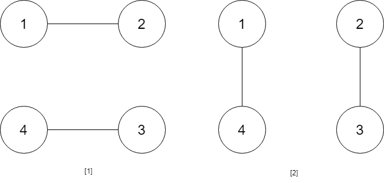

# week 45 (2019.11.17 - 2019.11.23)

## 1259. Handshakes That Don't Cross
You are given an even number of people num_people that stand around a circle and each person shakes hands with someone else, so that there are num_people / 2 handshakes total.

Return the number of ways these handshakes could occur such that none of the handshakes cross.

Since this number could be very big, return the answer mod 10^9 + 7

Example 1:

Input: num_people = 2
Output: 1

Example 2:

Input: num_people = 4
Output: 2
Explanation: There are two ways to do it, the first way is [(1,2),(3,4)] and the second one is [(2,3),(4,1)].

Example 3:

Input: num_people = 6
Output: 5
Example 4:

Input: num_people = 8
Output: 14

Constraints:

2 <= num_people <= 1000
num_people % 2 == 0

## 1258. Synonymous Sentences
Given a list of pairs of equivalent words synonyms and a sentence text, Return all possible synonymous sentences sorted lexicographically.
 

Example 1:

Input:
synonyms = [["happy","joy"],["sad","sorrow"],["joy","cheerful"]],
text = "I am happy today but was sad yesterday"
Output:
["I am cheerful today but was sad yesterday",
​​​​​​​"I am cheerful today but was sorrow yesterday",
"I am happy today but was sad yesterday",
"I am happy today but was sorrow yesterday",
"I am joy today but was sad yesterday",
"I am joy today but was sorrow yesterday"]
 

Constraints:

0 <= synonyms.length <= 10
synonyms[i].length == 2
synonyms[0] != synonyms[1]
All words consist of at most 10 English letters only.
text is a single space separated sentence of at most 10 words.

## 1257. Smallest Common Region
You are given some lists of regions where the first region of each list includes all other regions in that list.

Naturally, if a region X contains another region Y then X is bigger than Y.

Given two regions region1, region2, find out the smallest region that contains both of them.

If you are given regions r1, r2 and r3 such that r1 includes r3, it is guaranteed there is no r2 such that r2 includes r3.

It's guaranteed the smallest region exists.

 

Example 1:

Input:
regions = [["Earth","North America","South America"],
["North America","United States","Canada"],
["United States","New York","Boston"],
["Canada","Ontario","Quebec"],
["South America","Brazil"]],
region1 = "Quebec",
region2 = "New York"
Output: "North America"
 

Constraints:

2 <= regions.length <= 10^4
region1 != region2
All strings consist of English letters and spaces with at most 20 letters.

## 1256. Encode Number
Given a non-negative integer num, Return its encoding string.

The encoding is done by converting the integer to a string using a secret function that you should deduce from the following table:

Example 1:

Input: num = 23
Output: "1000"
Example 2:

Input: num = 107
Output: "101100"
 

Constraints:

0 <= num <= 10^9

## 1255. Maximum Score Words Formed by Letters
Given a list of words, list of  single letters (might be repeating) and score of every character.

Return the maximum score of any valid set of words formed by using the given letters (words[i] cannot be used two or more times).

It is not necessary to use all characters in letters and each letter can only be used once. Score of letters 'a', 'b', 'c', ... ,'z' is given by score[0], score[1], ... , score[25] respectively.

 

Example 1:

Input: words = ["dog","cat","dad","good"], letters = ["a","a","c","d","d","d","g","o","o"], score = [1,0,9,5,0,0,3,0,0,0,0,0,0,0,2,0,0,0,0,0,0,0,0,0,0,0]
Output: 23
Explanation:
Score  a=1, c=9, d=5, g=3, o=2
Given letters, we can form the words "dad" (5+1+5) and "good" (3+2+2+5) with a score of 23.
Words "dad" and "dog" only get a score of 21.
Example 2:

Input: words = ["xxxz","ax","bx","cx"], letters = ["z","a","b","c","x","x","x"], score = [4,4,4,0,0,0,0,0,0,0,0,0,0,0,0,0,0,0,0,0,0,0,0,5,0,10]
Output: 27
Explanation:
Score  a=4, b=4, c=4, x=5, z=10
Given letters, we can form the words "ax" (4+5), "bx" (4+5) and "cx" (4+5) with a score of 27.
Word "xxxz" only get a score of 25.
Example 3:

Input: words = ["leetcode"], letters = ["l","e","t","c","o","d"], score = [0,0,1,1,1,0,0,0,0,0,0,1,0,0,1,0,0,0,0,1,0,0,0,0,0,0]
Output: 0
Explanation:
Letter "e" can only be used once.
 

Constraints:

1 <= words.length <= 14
1 <= words[i].length <= 15
1 <= letters.length <= 100
letters[i].length == 1
score.length == 26
0 <= score[i] <= 10
words[i], letters[i] contains only lower case English letters.

## 1254. Number of Closed Islands
Given a 2D grid consists of 0s (land) and 1s (water).  An island is a maximal 4-directionally connected group of 0s and a closed island is an island totally (all left, top, right, bottom) surrounded by 1s.

Return the number of closed islands.

 

Example 1:

Input: grid = [[1,1,1,1,1,1,1,0],[1,0,0,0,0,1,1,0],[1,0,1,0,1,1,1,0],[1,0,0,0,0,1,0,1],[1,1,1,1,1,1,1,0]]
Output: 2
Explanation: 
Islands in gray are closed because they are completely surrounded by water (group of 1s).

Example 2:

Input: grid = [[0,0,1,0,0],[0,1,0,1,0],[0,1,1,1,0]]
Output: 1
Example 3:

Input: grid = [[1,1,1,1,1,1,1],
               [1,0,0,0,0,0,1],
               [1,0,1,1,1,0,1],
               [1,0,1,0,1,0,1],
               [1,0,1,1,1,0,1],
               [1,0,0,0,0,0,1],
               [1,1,1,1,1,1,1]]
Output: 2
 

Constraints:

1 <= grid.length, grid[0].length <= 100
0 <= grid[i][j] <=1

## 1253. Reconstruct a 2-Row Binary Matrix
Given the following details of a matrix with n columns and 2 rows :

The matrix is a binary matrix, which means each element in the matrix can be 0 or 1.
The sum of elements of the 0-th(upper) row is given as upper.
The sum of elements of the 1-st(lower) row is given as lower.
The sum of elements in the i-th column(0-indexed) is colsum[i], where colsum is given as an integer array with length n.
Your task is to reconstruct the matrix with upper, lower and colsum.

Return it as a 2-D integer array.

If there are more than one valid solution, any of them will be accepted.

If no valid solution exists, return an empty 2-D array.

 

Example 1:

Input: upper = 2, lower = 1, colsum = [1,1,1]
Output: [[1,1,0],[0,0,1]]
Explanation: [[1,0,1],[0,1,0]], and [[0,1,1],[1,0,0]] are also correct answers.
Example 2:

Input: upper = 2, lower = 3, colsum = [2,2,1,1]
Output: []
Example 3:

Input: upper = 5, lower = 5, colsum = [2,1,2,0,1,0,1,2,0,1]
Output: [[1,1,1,0,1,0,0,1,0,0],[1,0,1,0,0,0,1,1,0,1]]
 

Constraints:

1 <= colsum.length <= 10^5
0 <= upper, lower <= colsum.length
0 <= colsum[i] <= 2

## 1252. Cells with Odd Values in a Matrix
Given n and m which are the dimensions of a matrix initialized by zeros and given an array indices where indices[i] = [ri, ci]. For each pair of [ri, ci] you have to increment all cells in row ri and column ci by 1.

Return the number of cells with odd values in the matrix after applying the increment to all indices.

 

Example 1:

Input: n = 2, m = 3, indices = [[0,1],[1,1]]
Output: 6
Explanation: Initial matrix = [[0,0,0],[0,0,0]].
After applying first increment it becomes [[1,2,1],[0,1,0]].
The final matrix will be [[1,3,1],[1,3,1]] which contains 6 odd numbers.

Example 2:

Input: n = 2, m = 2, indices = [[1,1],[0,0]]
Output: 0
Explanation: Final matrix = [[2,2],[2,2]]. There is no odd number in the final matrix.
 

Constraints:

1 <= n <= 50
1 <= m <= 50
1 <= indices.length <= 100
0 <= indices[i][0] < n
0 <= indices[i][1] < m