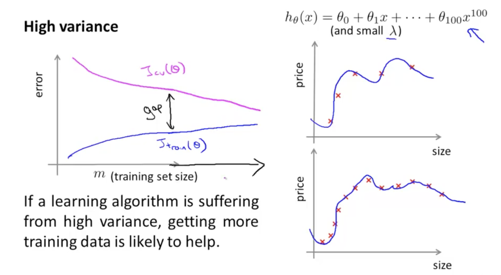

# Advice for Applying Machine Learning
- improving its performance
- machine learning system design

- machine learning diagnostic

# Evaluating Your Hypothesis
为什么说只分为 test/train 的时候，test 多了一个参数呢？
是因为，theta 维度不一样的时候，模型就不一样。
我们选择 使用 test 效果最好的 theta 的维度。这种 theta 维度的选择本身就是一种偏向 test 的过拟合。

所以我们把数据分成 train/cross validation/test

使用 train 训练，使用 cross validation 选择模型（theta 的维度），用 test 作为模型的评估。

# Bias vs. Variance

https://www.coursera.org/learn/machine-learning/supplement/81vp0/diagnosing-bias-vs-variance

variance: 这个还比较好理解的，因为多项式的最高次幂越高，模型越复杂越容易过拟合呗。如果 training 损失较小，而 validation 损失较大，说明过拟合。
bias: variance 比较小的时候，training and validation data set 的损失都比较大。这个时候 bias 影响较大，说明 欠拟合（underfit）

具体的可以看这个课：https://www.coursera.org/learn/machine-learning/lecture/yCAup/diagnosing-bias-vs-variance

# 选择 lambda 时 validation set and test set 的作用。
- 使用 validation set 选出最优的 lambda 值
- 使用选出的 lambda 在 test set 上测试，在 test set 得到的损失值更能说明 当前 lambda 的泛化能力。

在 validation set 上选出 lambda 的过程中，已经加入了人工筛选（在一组数据中选出最优的），不能代表该 lambda 的泛化能力（在未知数据上的表现）。

# lambda 的大小与 validation/training 数据的关系

当 lambda 比较小的时候，theta 受到的惩罚较小，容易过拟合。
当 lambda 比较大的时候，theta 受到的惩罚较大（导致 theta 都比较小，甚至是 0），容易欠拟合（Bias 对结果影响较大）。

# 当模型欠拟合的时候，增加数据，作用也没有特别大（因为模型复杂度不够，不能从数据中学出更多的东西）
https://www.coursera.org/learn/machine-learning/lecture/Kont7/learning-curves

> 最开始，数据增加的时候，training set 的 error 为什么会上升呢？
难道是因为用来计算 error 的数据变多了？
通过下图可知，数据少的时候，拟合效果比较好，所以 error 就小喽。。

从图中可以看出数据

# 当 variance 比较高的时候，增加训练样本就比较好了。

# Deciding What to Do Next Revisited
https://www.coursera.org/learn/machine-learning/supplement/llc5g/deciding-what-to-do-next-revisited

Our decision process can be broken down as follows:

Getting more training examples: Fixes high variance
Trying smaller sets of features: Fixes high variance
Adding features: Fixes high bias
Adding polynomial features: Fixes high bias
Decreasing λ: Fixes high bias
Increasing λ: Fixes high variance.

