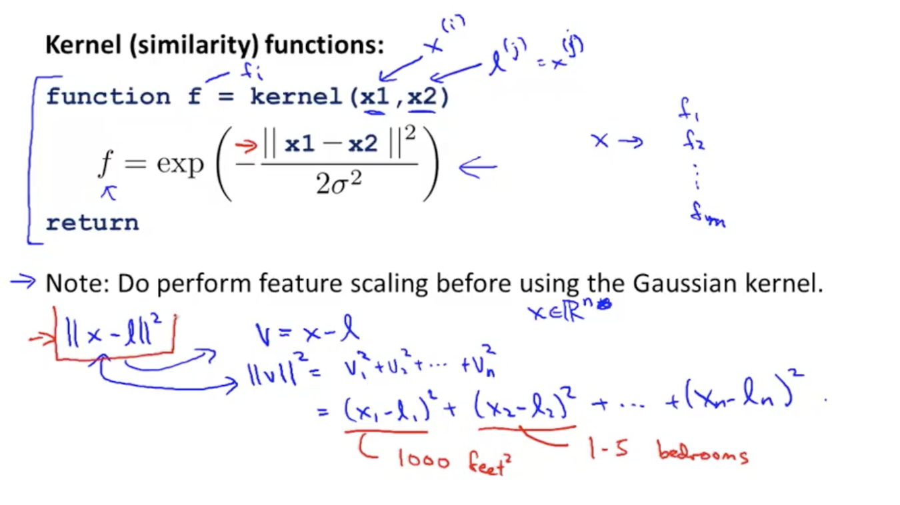

# 
SVM 中的 C 与 1/lambda 类似，但是，C 越大，对分错的点的惩罚越大。这样就会导致分类平面过于拟合。
通过下图可以非常直观的看出，C 太大的时候，哪怕只有少量的点与另外的类靠得比较近，分类平面也要把它分开。这是因为错分类的点的惩罚会很大（因为条数 C 很大）。
如果 C 适中，就可以有更好的适应性。

# math behind large margin classification

# Kernel I
landmark? 是一个距离函数。越靠近这个点，函数值越大。自然就可以把靠近的点和远离的点分开。

1. How do we choose those landmarks/How do we get those landmarks

https://www.coursera.org/learn/machine-learning/lecture/hxdcH/kernels-ii
> So in practice this is how the landmarks are chosen which is that given the machine learning problem. We have some data set of some some positive and negative examples. So, this is the idea here which is that we're gonna take the examples and for every training example that we have, we are just going to call it. We're just going to put landmarks as exactly the same locations as the training examples. 
最后一句，把样本中的每个点都作为 landmark？

2. Other similiarity function 

3. SVM 与 similarity function 的关系是什么？
突然想到 similarity function 可以认为是距离函数，这样就和我之前的理解有一些共同之处了。

4. 为什么不把核技巧推广到其它算法中

11:07
And by the way, in case your wondering why we don't apply the kernel's idea to other algorithms as well like logistic regression, it turns out that if you want, you can actually apply the kernel's idea and define the source of features using landmarks and so on for logistic regression. But the computational tricks that apply for support vector machines don't generalize well to other algorithms like logistic regression. And so, using kernels with logistic regression is going too very slow, whereas, because of computational tricks, like that embodied and how it modifies this and the details of how the support vector machine software is implemented, support vector machines and kernels tend go particularly well together. Whereas, logistic regression and kernels, you know, you can do it, but this would run very slowly. And it won't be able to take advantage of advanced optimization techniques that people have figured out for the particular case of running a support vector machine with a kernel. But all this pertains only to how you actually implement software to minimize the cost function. I will say more about that in the next video, but you really don't need to know about how to write software to minimize this cost function because you can find very good off the shelf software for doing so.

# sigma small, lower biase, higher variance.
比较尖
# sigma larger, higher biase, lower variance.
比较缓

# sigma and lambda similarity

# using svm

https://www.coursera.org/learn/machine-learning/lecture/sKQoJ/using-an-svm
线性核：特征维度较高，而样本较少时

# Gausian Kernel 使用时，要对样本进行 scaling

