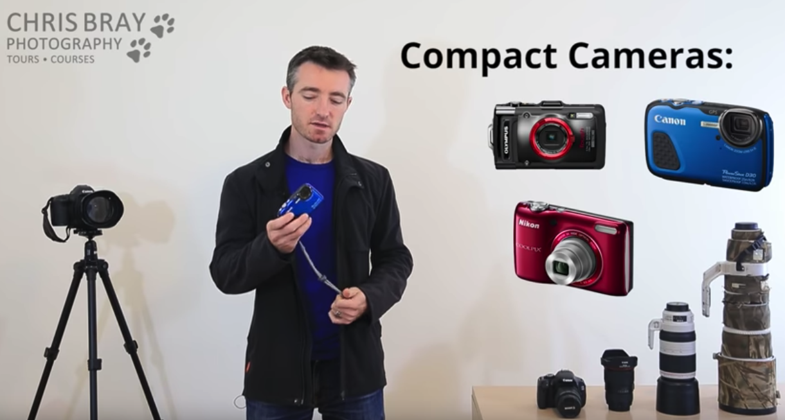

想学习摄影，其实是想提高自己的审美能力。
或者说，发现欣赏美的角度。

# [Photography Basic & Getting Off 'Auto' - Photography Course Pt 2](https://www.youtube.com/watch?v=My1Z2_e4EPI&index=2&list=PLG3eOzJfQr2e2OD4W0GmcSpO5oZ-c5FIu&pbjreload=10) 摆脱单反的“自动”模式

## 相机分类
1. 卡片相机

