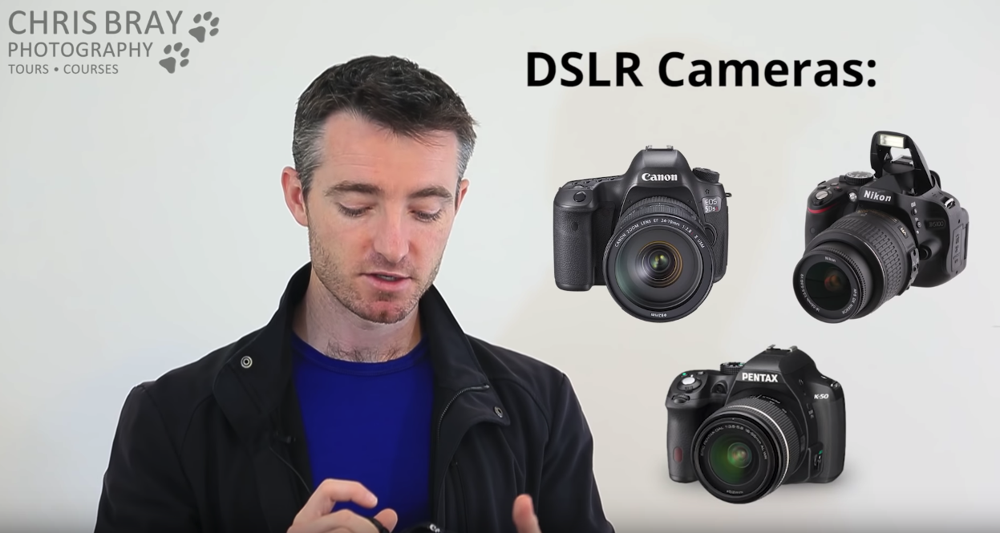
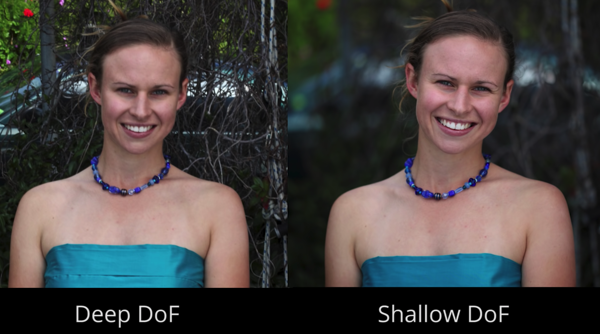
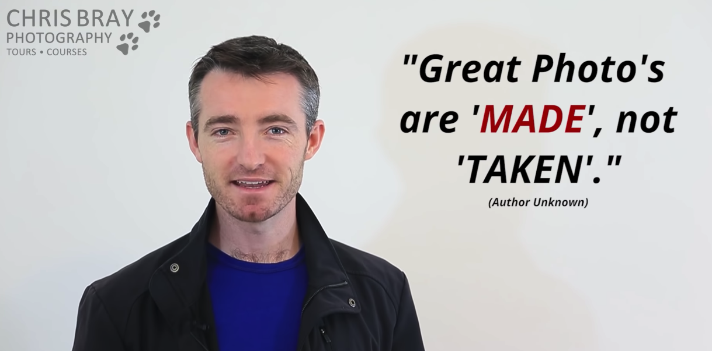
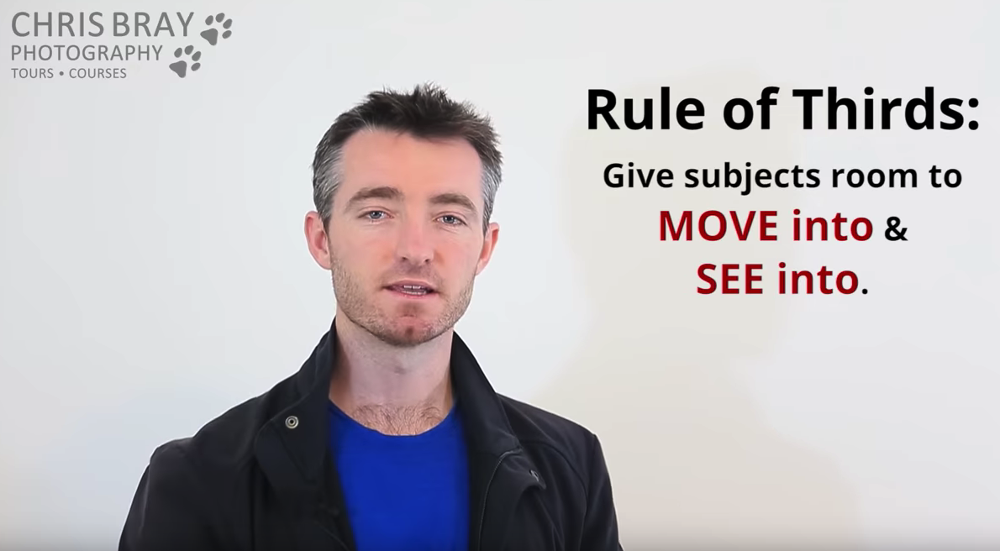

想学习摄影，其实是想提高自己的审美能力。
或者说，发现欣赏美的角度。

# [Photography Basic & Getting Off 'Auto' - Photography Course Pt 2](https://www.youtube.com/watch?v=My1Z2_e4EPI&index=2&list=PLG3eOzJfQr2e2OD4W0GmcSpO5oZ-c5FIu&pbjreload=10) 摆脱单反的“自动”模式

## 相机分类
1. 卡片相机（Compact Cameras）

2. 数码单反相机（Digital Single-Lens Cameras）

## 单反带来的图片层次感

右侧的照片，凸显了模特，虚化了无关的背景。

# Questions
1. AF-C & AF-S
2. 相机对焦的原理是啥？
3. 14-24 & 24-70 啥意思？
4. Diopter 作用？
5. P Mode ？
6. Auto Focus(AF)
7. Stabilising
8. High Res, Fine Quality
9. AF Mode(1-shot/AF-S)
10. Centre AF Point

# Great Photo are MAKE, not TAKEN

# [Top 10 Composition Tips - Photography Course Pt 3](https://www.youtube.com/watch?v=5V4uuNdmRHc&index=3&list=PLG3eOzJfQr2e2OD4W0GmcSpO5oZ-c5FIu)

1. Horizontal Horizons 保持地平线水平
2. Rule of Thirds 目标物体三分之一准责。把目标放在图片中间会显得有点怪怪的，不如放在左边或者右边三分之一处。感觉有点找黄金分隔点的意思。

> Good Composition beats trying to 'fit everything in'.

3. Framing 取景

取景是有意在画面里面添加一些内容，来增加照片的层次感和一些其它的东西。

如果拍一些比较远的地方的，有一些参照的话，可以让画面不至于太飘。

如果没有近处的参照物的话，对无处的海岸就很难有一个大小的参照。画面的表现力就会变弱（因为你给出的距离信息太少），画面就会显得过于平面。
单就这两幅图来看，其实我更喜欢没有近景的这个。海岸上的石头已经能作为一定的参考了。
<figure class="half">
    
    
</figure>

这两幅图，单看第一个远景，我还挺喜欢的。但是看了第二个，我觉得那个树影让我很有亲切感。
我猜想，是这个树把观看照片的人代入到了拍摄时的情景当中。会让人看到之后想“哦，这有个树。嗯，那拍摄者就站在这里喽（指着照片和自己眼前这片地）。”
<figure class="half">
    
    
</figure>
