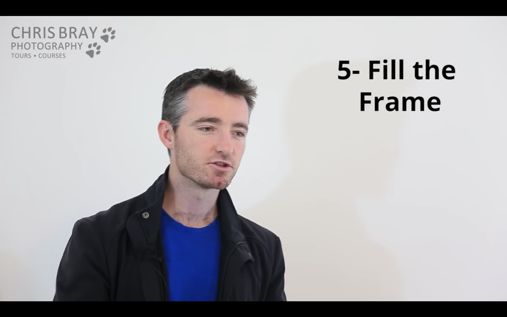

想学习摄影，其实是想提高自己的审美能力。
或者说，发现欣赏美的角度。

> 照片就是个媒介，通过它展现你想要表达的信息。不同的照片，想要表达的信息量和信息是不一样的。一幅好的照片，能传递给人的感觉是什么样的呢？这些都需要艺术家来把握。

# [Photography Basic & Getting Off 'Auto' - Photography Course Pt 2](https://www.youtube.com/watch?v=My1Z2_e4EPI&index=2&list=PLG3eOzJfQr2e2OD4W0GmcSpO5oZ-c5FIu&pbjreload=10) 摆脱单反的“自动”模式

## 相机分类
1. 卡片相机（Compact Cameras）

2. 数码单反相机（Digital Single-Lens Cameras）

## 单反带来的图片层次感

右侧的照片，凸显了模特，虚化了无关的背景。

# Questions
1. AF-C & AF-S
2. 相机对焦的原理是啥？
3. 14-24 & 24-70 啥意思？
4. Diopter 作用？
5. P Mode ？
6. Auto Focus(AF)
7. Stabilising
8. High Res, Fine Quality
9. AF Mode(1-shot/AF-S)
10. Centre AF Point

# Great Photo are MAKE, not TAKEN

# [Top 10 Composition Tips - Photography Course Pt 3](https://www.youtube.com/watch?v=5V4uuNdmRHc&index=3&list=PLG3eOzJfQr2e2OD4W0GmcSpO5oZ-c5FIu)

# 1. Horizontal Horizons 保持地平线水平
# 2. Rule of Thirds 目标物体三分之一准责。把目标放在图片中间会显得有点怪怪的，不如放在左边或者右边三分之一处。感觉有点找黄金分隔点的意思。

> Good Composition beats trying to 'fit everything in'.

# 3. Framing 取景

取景是有意在画面里面添加一些内容，来增加照片的层次感和一些其它的东西。

如果拍一些比较远的地方的，有一些参照的话，可以让画面不至于太飘。

如果没有近处的参照物的话，对无处的海岸就很难有一个大小的参照。画面的表现力就会变弱（因为你给出的距离信息太少），画面就会显得过于平面。
单就这两幅图来看，其实我更喜欢没有近景的这个。海岸上的石头已经能作为一定的参考了。
<figure class="half">
    
    
</figure>

这两幅图，单看第一个远景，我还挺喜欢的。但是看了第二个，我觉得那个树影让我很有亲切感。
我猜想，是这个树把观看照片的人代入到了拍摄时的情景当中。会让人看到之后想“哦，这有个树。嗯，那拍摄者就站在这里喽（指着照片和自己眼前这片地）。”
<figure class="half">
    
    
</figure>

# 4. Check your Backgrounds!

这个很好理解，不要让无关的背景分散照片的焦点。
比如 
大象远侧的观光车就在影响观者的注意力了。

但是，背景影响画面的情况还挺多的。
狮子的黄色和背景的黄色草原混在一起，不太容易引起视觉的反差。以天空为背景就好很多了。
虽然在我这个直男的眼里差不多。。。
<figure class="half">
    
    
</figure>

接着看一些其它的例子，感受一下：
<figure class="some-cases">
    
    
    
</figure>
<figure class="some-cases">
    
    
</figure>

# 5. Fill the Frame 让主要目标填充画幅

> Sometime, pictures could do it being cropped in a little bit tighter

有时候为了让构图更加紧凑，就要尽量让目标事物填充画面。
但是，如果把太多无关的东西放在画面里面，就会分散观看者的注意力，降低照片的表现力。
如下图，主要是想显示出鲸鱼。小船是为了使鲸鱼的大小有一个对比，同时增加了画面的故事性（偶遇鲸鱼也是一件很有意思的事情吧）。
<figure class="some-cases">
    
    
</figure>

下面第二幅讲述的内容是潜水遇到一个海星。第一幅有点分散，她拿了袋子。。是在偷海星么。。
<figure class="some-cases">
    
    
</figure>

<figure class="some-cases">
    
    
</figure>

大象的头也没必要拍全。

# 6. Leading lines
这个线自然引导人们去看无处的人，再由无处的人的目光看到彩虹。
这个引导线就非常牛。

> Tips: Make sure it comes in through the corner of your shot。即从相框边角的引导线，更有效。虽然还是不太明白。。。

# 7. Anything but Eye-level & Get at the Same level as your Subject
这个标题的意思应该是，要从不一样的角度去拍摄。
但是对于你要拍摄的一些事物，如一个小狗、小孩、小动物，可能和他们同一个水平面上拍摄会更好。

我们对日常事情可能习以为常，但是换一些高度、角度再来看待一些事情，可能会有更新奇的发现。

下面这个角度让，我想起了大学时候的一个摄影老师。
有次实践课，老师给我们示范拍摄，他就趴在地上拍。我们当时觉得有趣，大家都在拍老师。

下面这两个说明对待拍摄对象的角度应该在同一水平面上。
<figure class="some-cases">
    
    
    
</figure>

# 8. Look for Details
寻找不一样的细节。

下面这两个可以从说明细节带来的新奇体验。这两个图不能评价优劣，只是观察角度和要讲述的故事不一样。
<figure class="some-cases">
    
    
</figure>

# 个人理解
> 4 和 5 都是为了减少那些分散注意力的东西

$$expression = \frac{target}{environment}$$

那么对图像来说，就要平衡增多要表达的内容，减少无关内容的关系。
因为减少的越多，相关要表达的内容可能就越少。
