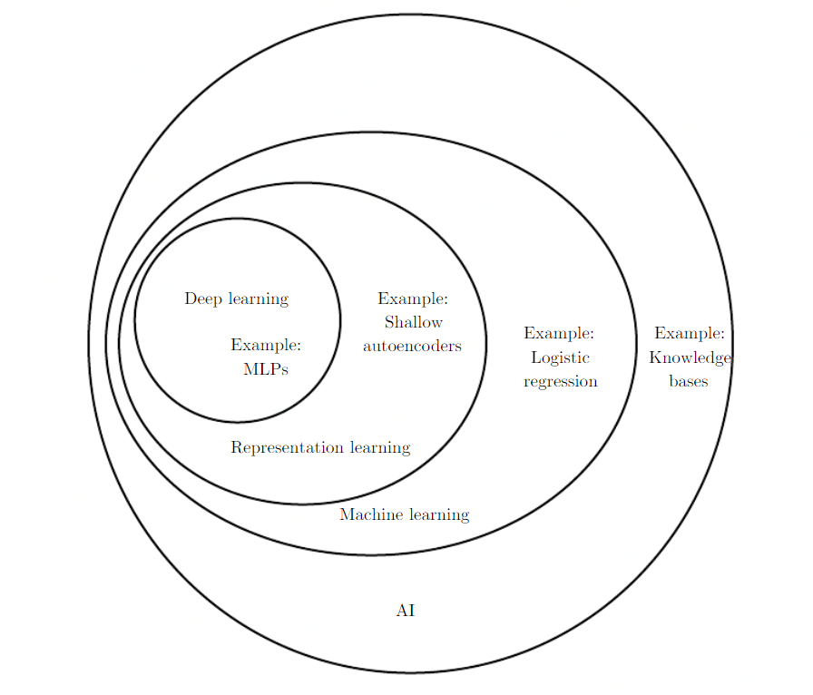
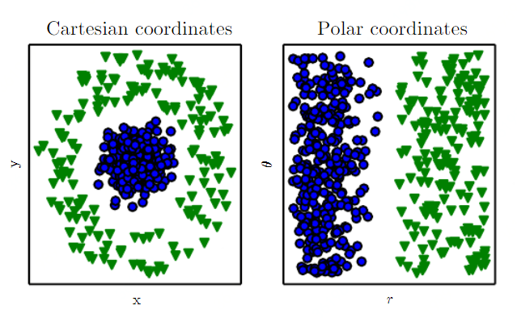

# Deep Learning

# [Introduction](http://www.deeplearningbook.org/contents/intro.html)

```
The difficulties faced by systems relying on hard-coded knowledge suggestthat AI systems need the ability to acquire their own knowledge, by extracting patterns from raw data. This capability is known asmachine learning.
```

从原始数据中抽取模式，获取新知识的研究，被称作机器学习（Machine Learning\)。

```
The performance of these simple machine learning algorithms depends heavilyon therepresentationof the data they are given. 
For example, when logistic regression is used to recommend cesarean delivery, the AI system does not examine the patient directly. 
Instead, the doctor tells the system several pieces of relevantinformation, such as the presence or absence of a uterine scar. 
Each piece ofinformation included in the representation of the patient is known as afeature.
Logistic regression learns how each of these features of the patient correlates withvarious outcomes. 
However, it cannot influence how features are defined in anyway. 
If logistic regression were given an MRI scan of the patient, rather thanthe doctor’s formalized report, it would not be able to make useful predictions.
Individual pixels in an MRI scan have negligible correlation with any complicationsthat might occur during delivery.
```

这段就讲的很好，logistic regression 严重依赖于从原始中获得的特征的质量。


_读完这一段，突然有些明白了 AI 领域里面的层次关系_：Knowledge base 尽量写好预先的规则；Machine learning 从拟定好的特征数据里面，学习一些决策规则；Representation learning 从原始数据里面学习特征？；Deep learning 就从原始数据里面学习特征，到最后的决策都有了。




合理地处理数据，生成用于描述数据的特征，对机器学习来说十分重要。通过图  可以看出同样的问题，在不同的体系内，处理的难度是不一样的。


# Representation learning

```
One solution to this problem is to use machine learning to discover not only the mapping from representation to output but also the representation itself.
This approach is known as representation learning. 
```
为了解决人工构造特征的困境，就引入了 representation learning。这一研究领域不仅想学习出特征到输出结果的模型，还要学习出从原始数据到特征的模型。


```
This solution isto allow computers to learn from experience and understand the world in terms ofa hierarchy of concepts, with each concept defined through its relation to simplerconcepts. By gathering knowledge from experience, this approach avoids the needfor human operators to formally specify all the knowledge that the computer needs.
The hierarchy of concepts enables the computer to learn complicated concepts bybuilding them out of simpler ones. 
If we draw a graph showing how these concepts built on top of each other, the graph is deep, with many layers. For this reason,we call this approach to AI deep learning.
```

深度学习：通过经验数据，学习出一系列层次概念。每个概念又通过这个概念与一些简单的概念之间的关系进行定义。通过对经验数据的学习，避免了人工定义计算机所需的所有知识。这种架构使计算机可以在简单概念的基础上学习出复杂的概念。如果我们要用图来表示这些概念之间的关系，我们将得到一个非常深的、具有很多层的图。因此，我们称这种方法为深度学习（deep learning）。

