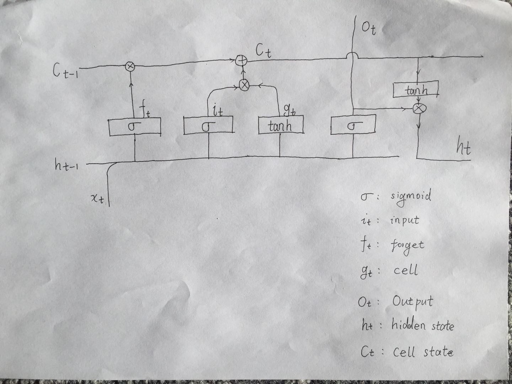

# pytorch lstm 
> 最近看了一段时间 rnn，也算对各种 rnn 有了一定的了解。在看各种文档的过程中，也想通了一些之后不明确的点。但是仍然有挺多不太明白的地方。

torch.nn.LSTM 模块的结点细节如图：

[colah](http://colah.github.io/posts/2015-08-Understanding-LSTMs/) 写的博客里面写的比较详细。
下面来介绍一下图中几个输出的意义和作用。
首先我们明确一点 `sigmoid` 
- C_{t -1 }: 结点保留信息，这个可以认为是之前输入保存的信息综合体。
- h_t: 隐藏信息，由上次的输出和综合结点信息共同生成。作为下次结点输入的一部分。
- x_t:
- f_t: 遗忘门。数据范围 [0, 1]，用来对以往时态传过来的结点状态进行遗忘。
- i_t:
- g_t: 用于更新结点状态的备用值。
- C_t: 更新之后的结点状态。

##
- 遗忘之前的结点信息
- 更新当前的结点信息
- 

其实，每次的输出结点的输入信息，只有新输入的数据和之前保留的隐藏数据（h_{t - 1}, x_t）。

# 参考
[torch.nn.LSTM](http://pytorch.org/docs/master/nn.html#torch.nn.LSTM)
[cs231n 反向传播](http://cs231n.github.io/optimization-2/)
